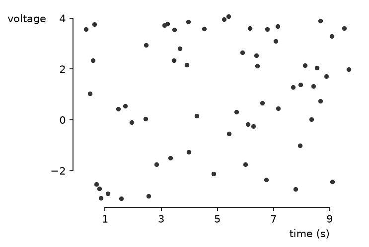

# vanzelfsprekend

A matplotlib plot arrives framed in a box: four spines at the view limits, none of them saying anything about the data inside. A range frame makes those lines work. The top and right spines go, and the two that remain are trimmed to the data, so each spine reports its variable's minimum and maximum. Ticks land on nice numbers strictly inside the data range, and the axis labels sit at the spine ends instead of the middle. Range frames come from Tufte's *The Visual Display of Quantitative Information*; the tick placement is Talbot, Lin and Hanrahan's extended Wilkinson algorithm (mizani's `breaks_extended`). The name is Dutch for self-evident, literally "self-speaking": the plot speaks for itself.



## Install

Not on PyPI yet. Install from a checkout:

```sh
uv add /path/to/vanzelfsprekend
```

## Quickstart

The figure above, in full:

```python
import matplotlib.pyplot as plt
import numpy as np

import vanzelfsprekend as vfs

rng = np.random.default_rng(0)
fig, ax = plt.subplots(figsize=(5, 3.5))
ax.scatter(rng.uniform(0.3, 9.7, 60), rng.uniform(-3.2, 4.1, 60), s=12, color="0.2")
vfs.apply(ax)
vfs.xlabel(ax, "time (s)")
vfs.ylabel(ax, "voltage", flush=True)
fig.savefig("scatter.png", dpi=150, bbox_inches="tight")
```

`apply` trims the spines on every draw, so the frame keeps hugging the data through later autoscales and tick changes. `restore` puts the axes back exactly as they were.

## Usage

`apply(ax)` ends the spines at the outermost ticks. Two other modes:

```python
vfs.apply(ax, frame="data")   # spines end at the exact data min and max
vfs.apply(ax, frame="loose")  # spines end at nice numbers bounding the data
```

`xlabel` sits below the right end of the bottom spine; `ylabel` sits horizontal at the top of the left spine. `flush=True` anchors the y-label at the topmost tick label; `labelpad` widens the gap to the tick labels:

```python
vfs.ylabel(ax, "count", flush=True, labelpad=10)
```

`register()` adds the entry points as Axes methods, so `ax.apply()` and `ax.restore()` work anywhere; `unregister()` removes them again.

Only plain linear axes are handled. A log-scaled axis, or one with a units converter (dates, categories), is left untouched with a warning.

## API

| Name | Does |
| --- | --- |
| `apply(ax, ...)` | the full treatment with defaults |
| `restore(ax)` | put the axes back as they were |
| `range_frame(ax, frame, n, offset, ...)` | the range frame, with every knob |
| `xlabel(ax, text)`, `ylabel(ax, text, flush)` | end-of-spine axis labels |
| `register()`, `unregister()` | add or remove the `ax.apply` and `ax.restore` methods |
| `TalbotLocator(n, loose, ...)` | the tick locator, usable on its own |

Parameters and behavior are documented in the docstrings.
