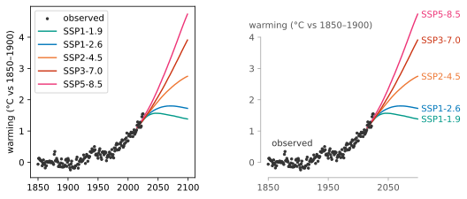

*Above all else show the data.* — Edward Tufte

<figure markdown>

<figcaption markdown>The same plotting calls twice, matplotlib's defaults on the left. The right panel adds `apply`, `line_labels` in place of the legend, and one `label` on the observed record.</figcaption>
</figure>

One call, `vzs.apply(ax)`, gives the axes a range frame and mutes its furniture. The box becomes two spines, each ending at the last labelled tick inside its data, so a spine's end always carries a value. The ticks fall on round numbers inside the data. The furniture fades to grey, and the ink goes to the data.

The data are yours: you draw them, and you know which line is the message. Everything around the data is vanzelfsprekend's, to two ends. The range frame is Tufte's and shows the data above all else: each spine ends on a labelled value inside its data, with round numbers between,[^talbot] so the frame reports the range instead of boxing it.[^tufte] The muting and the direct labels are Doumont's and let the figure speak for itself: the furniture goes grey so the data stand out, and each line is named where it ends, so no legend is needed. His caption to a graph he redrew says both at once.[^doumont]

> The graph shows the data and nothing but the data: tick marks are relevant, not arbitrarily equidistant; nondata lines are gray, to make the data prominent.

Install it with `uv add vanzelfsprekend` or `pip install vanzelfsprekend`.

Where to go next: the [tutorial](tutorial/old-faithful.md) builds three figures from scratch. The [how-to](how-to/frame-modes.md) pages answer one question each. The [gallery](gallery.md) shows what the range frame does to real data. The [reference](reference/axes.md) is generated from the docstrings, and the [explanation](explanation/ideas.md) pages say where the ideas come from.

The data are yours and [stay as you drew them](explanation/boundary.md). The frame, the ticks and the labels are vanzelfsprekend's, and their one job is to show the data.

[^tufte]: Edward R. Tufte, *The Visual Display of Quantitative Information* (Cheshire, Connecticut: Graphics Press, 1983), chapter 4, where the epigraph heads his five principles of data-ink.
[^doumont]: Jean-luc Doumont, *Trees, Maps, and Theorems: Effective Communication for Rational Minds* (Brussels: Principiae, 2009), from the caption to the graph he redraws.
[^talbot]: The round numbers are chosen by Talbot, Lin and Hanrahan's search, and their paper opens with Doumont's point from the other side: "The non-data components of a visualization, such as axes and legends, can often be just as important as the data itself." Justin Talbot, Sharon Lin and Pat Hanrahan, ["An Extension of Wilkinson's Algorithm for Positioning Tick Labels on Axes"](http://vis.stanford.edu/papers/tick-labels), *IEEE Transactions on Visualization and Computer Graphics* 16, no. 6 (2010): 1036-1043.
