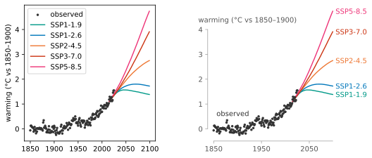

*Above all else show the data.* — Edward Tufte

<figure markdown>

<figcaption markdown>The same plotting calls twice, matplotlib's defaults on the left. The right panel adds `apply`, `line_labels` in place of the legend, and one `label` on the observed record.</figcaption>
</figure>

vanzelfsprekend does three things to show the data. It frames them, mutes the furniture around them, and accents the features you name.

It frames the data. The box becomes two spines, each ending at the last labelled tick inside its data, so a spine's end always carries a value. Between the ends the ticks fall on round numbers,[^talbot] chosen by a [locator](how-to/locators.md) that reads the data rather than the view limits.

It mutes the furniture. The spines, tick marks and labels go grey and the grid goes, so the data carry the only dark ink on the page. `vzs.apply(ax)` does these first two in one call.

It accents the features. A line is named where it ends instead of in a legend (`line_labels`), a point you name gets a label beside it in the plot (`label`), and a feature the locator already ticks, a peak or a median, gets its tick label pulled forward in colour (`accent`).

The marks stay yours throughout. The library never moves, resizes or recolours a mark you drew, so it can read a finished figure, and `restore` puts everything back. [Furniture and meaning](explanation/furniture.md) draws that line.

Install it with `uv add vanzelfsprekend` or `pip install vanzelfsprekend`.

Where to go next: the [tutorial](tutorial/old-faithful.md) builds six figures from scratch. The [how-to](how-to/index.md) pages answer one question each. The [gallery](gallery.md) shows what the range frame does to real data. The [reference](reference/axes.md) is generated from the docstrings. [What to accent](explanation/accent.md) says what the furniture is for, [The frame follows the axes](explanation/hook.md) why the order of your calls is free, and [Sources and influences](explanation/sources.md) where the ideas come from.

The frame is Tufte's,[^tufte] the muting and the labels are Doumont's,[^doumont] and his caption to a graph he redrew says the first two in one line.

> The graph shows the data and nothing but the data: tick marks are relevant, not arbitrarily equidistant; nondata lines are gray, to make the data prominent.

[^tufte]: Edward R. Tufte, *The Visual Display of Quantitative Information* (Cheshire, Connecticut: Graphics Press, 1983), chapter 4, where the epigraph heads his five principles of data-ink.
[^doumont]: Jean-luc Doumont, *Trees, Maps, and Theorems: Effective Communication for Rational Minds* (Brussels: Principiae, 2009), from the caption to the graph he redraws.
[^talbot]: The round numbers are Talbot, Lin and Hanrahan's search, and their paper opens with the reason the choice deserves one: "The non-data components of a visualization, such as axes and legends, can often be just as important as the data itself." Justin Talbot, Sharon Lin and Pat Hanrahan, ["An Extension of Wilkinson's Algorithm for Positioning Tick Labels on Axes"](http://vis.stanford.edu/papers/tick-labels), *IEEE Transactions on Visualization and Computer Graphics* 16, no. 6 (2010): 1036-1043.
